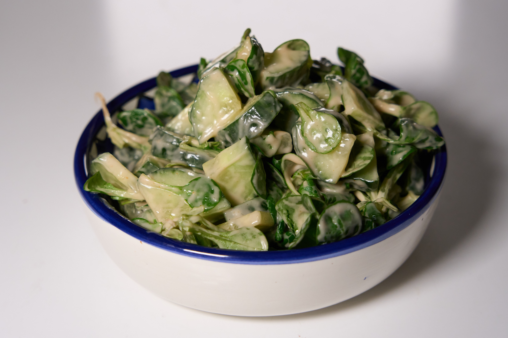
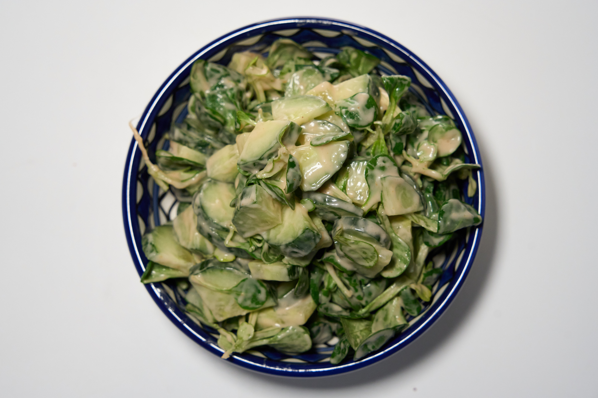

Eine sehr einfache aber sehr leckere Salatsoße

## Zutaten

* 2EL Joghurt (Hafer oder ungesüßtes Soja oder was man will)
* 1EL Mayonnaise (oder mehr 😏)
* 2TL Ketchup
* Knoblauchpulver
* Salz
* Pfeffer

## Kurzform
Alles zusammenmischen

## Anleitung

1. Alles zusammenmischen
2. Fertig
3. Idealerweise mit Salat servieren

