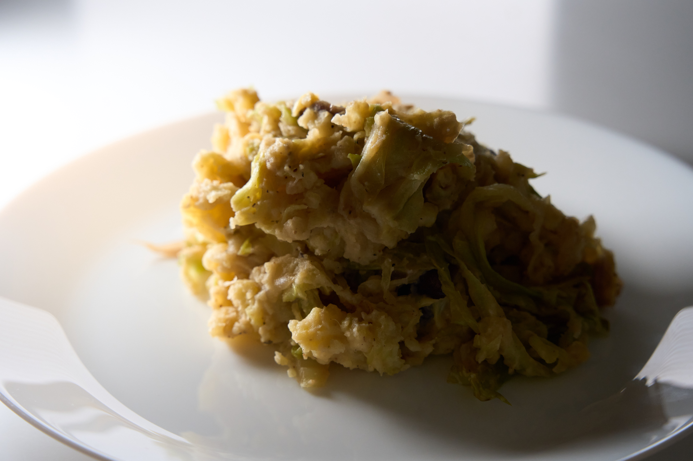

Ein Kartoffelbrei ist lecker, aber noch besser wird er wenn man ihn mit Kohl vermischt

## Zutaten

* 1kg Kartoffeln
* 750g Kohl (Spitzkohl, Wirsing, Chinakohl, Weißkohl, Rotkohl, Pak Choi oder was auch immer grade so kohlmäßig verfügbar ist)
* 250ml Pflanzensahne
* 50-100g Margarine (oder anderes Öl)
* 2 Zwiebeln
* 4 Zehen Knoblauch
* Salz
* Pfeffer
* Muskat
* Kreuzkümmel
* Piment

## Kurzform
Normal Kartoffelbrei machen, geschnittenen Kohl mit Zwiebeln und Knoblauch anbraten, danach zusammenmischen und würzen.

## Anleitung

1. Kartoffeln schälen, kleinschneiden und im gesalzenen Wasser kochen.
2. Die Zwiebeln kleinschneiden, glasig anbraten, dann den Knoblauch fein gehackt, gepresst oder gerieben dazu geben und kurz mit anbraten. Anschließend den kleingeschnittenen Kohl dazu geben. Je feiner der Kohl geschnitten ist desto schneller ist er fertig.
3. Wenn die Kartoffeln weich sind das Wasser abgießen und dann mit der Sahne und der Margarine stampfen.
4. Wenn der Kohl weich ist diesen in den Kartoffelbrei verrühren und alles mit den Gewürzen abschmecken.

