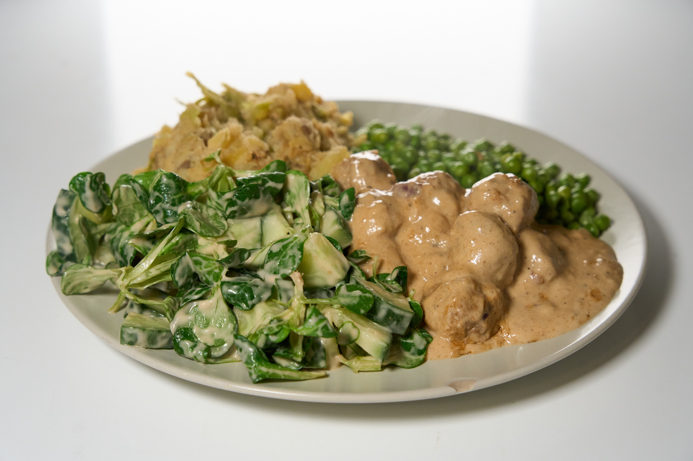
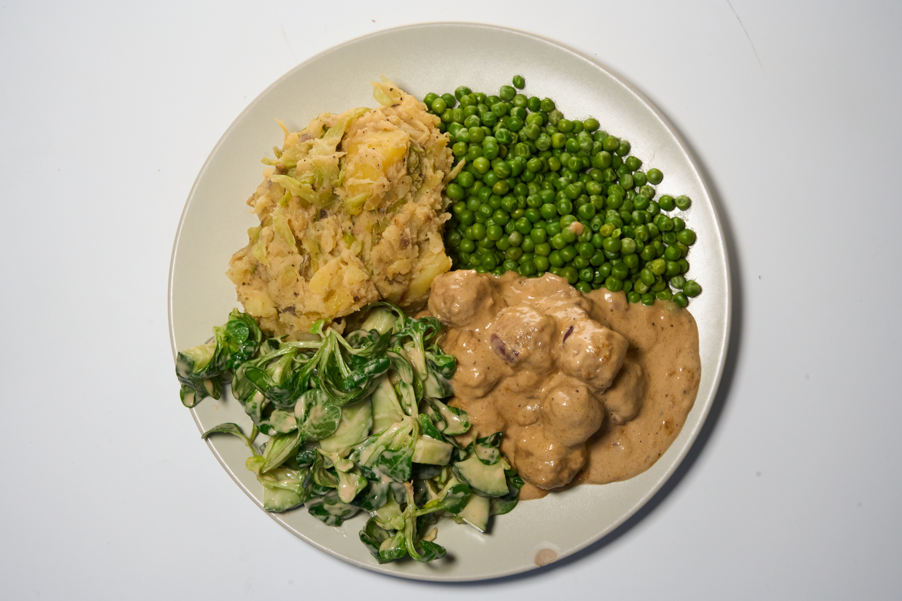

Köttbullar sind ein klassisches schwedisches Gericht, aber was sie deutlich besser macht ist natürlich eine Sahnesoße. Schmeckt sehr gut mit Erbsen, <Link to="../beste-salasose">Salat</Link> und Kartoffelbrei (auch mit <Link to="../kohlkartoffelbrei">Kohl</Link>)

## Zutaten

* 500g Köttbullar
* 1 Zwiebel
* 600ml Pflanzensahne (oder mehr, das Gericht ist eh niemand weil es gesund ist)
* 5EL Öl (Olive oder Raps, keine Margarine, die hat zu viel Wasser)
* 4EL Mehl
* 3EL Sojasoße
* 1TL Knoblauchpulver
* 1TL Muskat
* Salz
* Pfeffer

## Kurzform
Köttbullar braten, Zwiebel in Öl braten, Mehl mit anbraten, dann langsam die Sahne unterrühren, aufkochen lassen, würzen

## Anleitung

1. Die Köttbullar anbraten bis sie eine leicht braune Kruste haben
2. Die Zwiebel in kleine Würfel schneiden und in einer tiefen Pfanne in dem Öl anbraten. Wenn sie leicht glasig ist das Mehl dazu geben. Wenn das Mehl leicht angebräunt ist langsam die Sahne einrühren. Dabei so langsam gießen dass sich keine Klumpen bilden und nicht von dem zischen und blubbern stressen lassen.
3. Mit Sojasoße und den anderen Gewürzen abschmecken und einmal kurz aufkochen lassen. Anschließend die gebratenen Köttbullar unterrühren.
4. Mit Erbsen, <Link to="../beste-salasose">Salat</Link> und Kartoffelbrei (auch mit <Link to="../kohlkartoffelbrei">Kohl</Link>) oder was auch immer einem gut schmeckt servieren.

