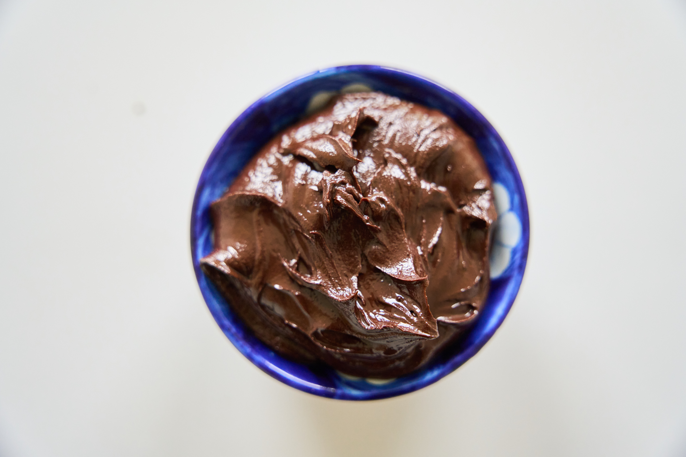
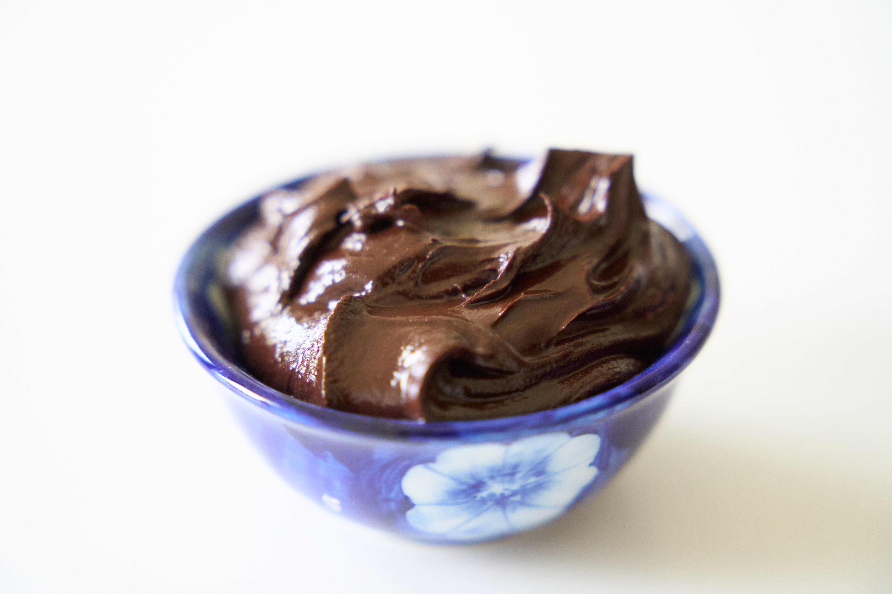

Eine leckere Schokopaste, wenn man mal dringend Bock darauf hat, aber der Laden keine vegane Schokopaste hat (oder es Sonntag ist und man in Deutschland wohnt)

## Zutaten

* 100g dunkle Kuvertüre
* 20g Kokosöl
* 30g Kokosmilch

## Kurzform
Schoko und Öl zusammen schmelzen, Kokosmilch dazu geben und verrühren bis es fest wird, ein bisschen abkühlen lassen

## Anleitung

1. Schokolade und Öl im Topf schmelzen, bis die Schokolade grade so geschmolzen ist.
2. Mit der Kokosmilch verrühren.
3. Wenn es zu flüssig ist einfach ein bisschen abkühlen lassen.
4. Nicht im Kühlschrank lagern, es sei denn man mag seine Schokopaste crunchy und unstreichbar.

