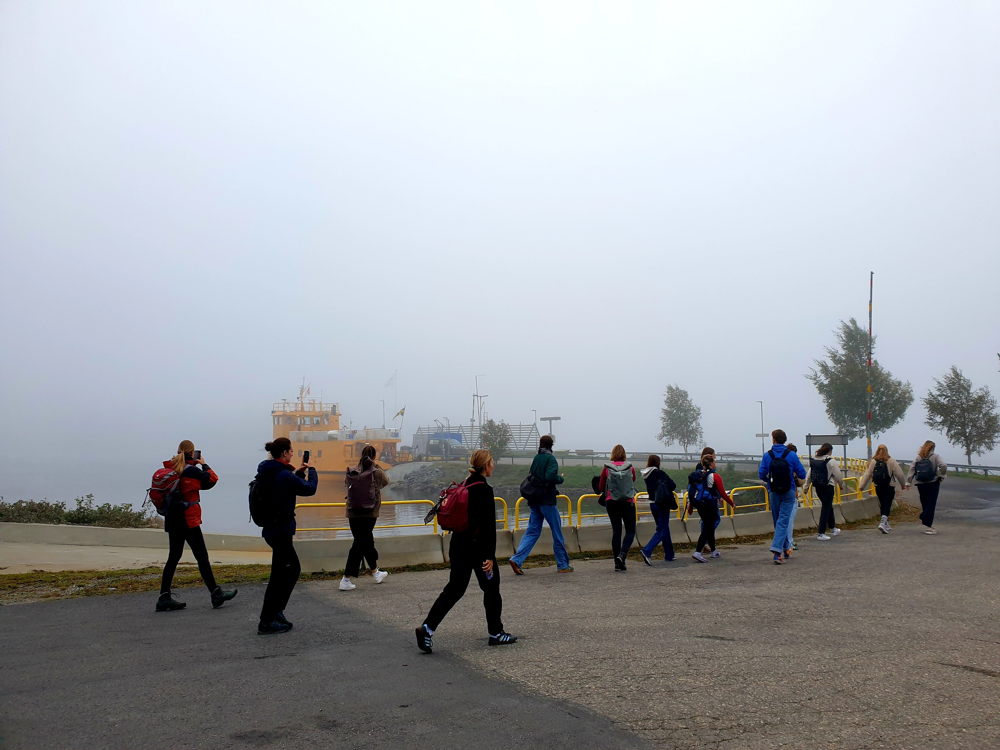
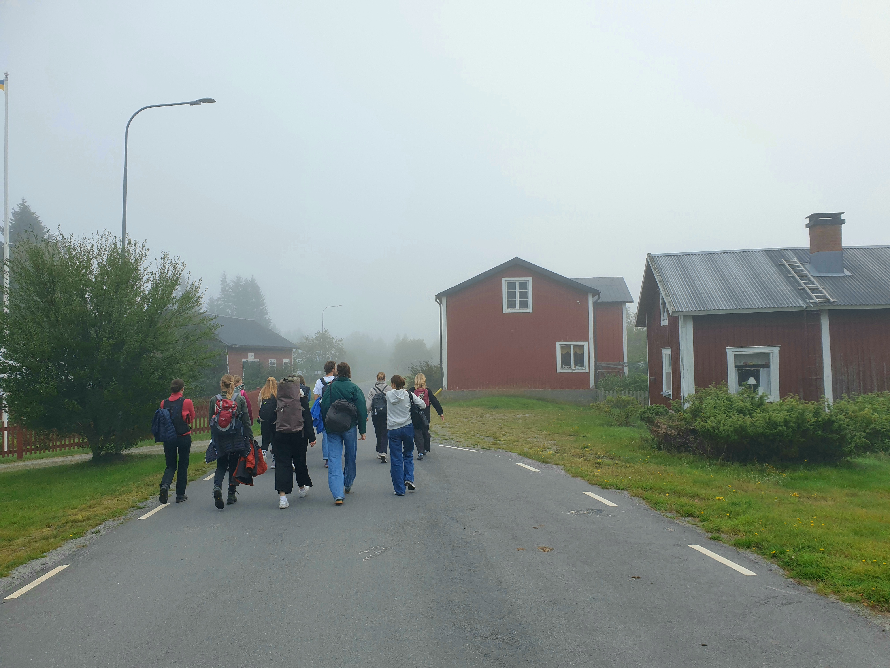
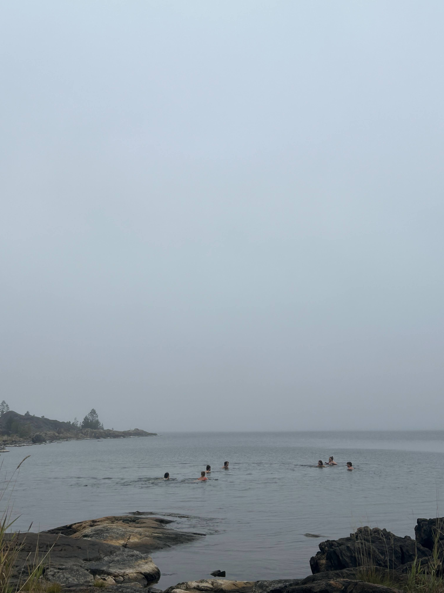
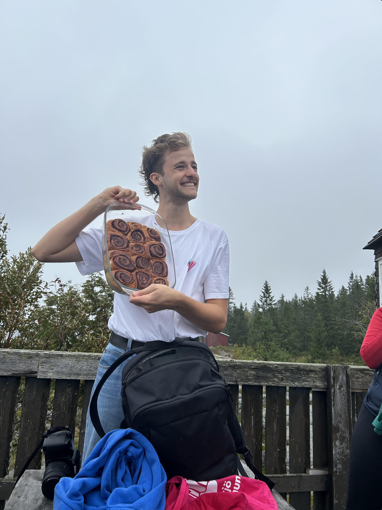
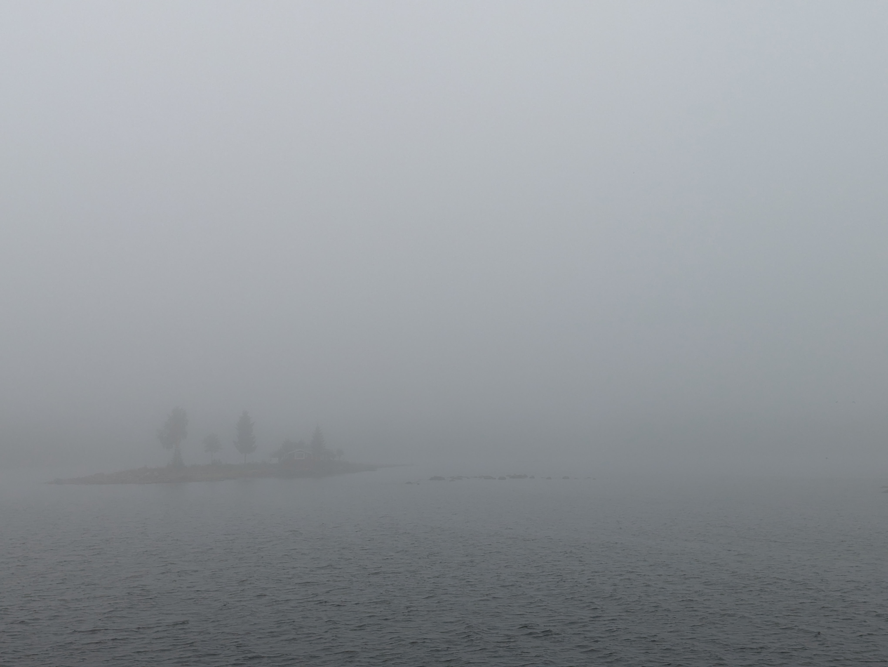

Heute haben wir einen kleinen Ausflug mit einer kleinen Fähre zu der kleinen Insel Holmön gemacht.

*Die Gang auf dem Weg zur Fähre*

Mit dabei war die Kerngruppe plus ein Haufen Freund:innen die zu Besuch waren. Es war sehr neblig und auf der Fähre konnte man nicht weit schauen. Zwischendrin wurde der Nebel dann ein bisschen lichter, der kam aber pünktlich zur Rückfahrt wieder.

*Die ganze Gruppe (bei der Aufnahme dieses Fotos wurden (fast) keine Handys verletzt)*

Die Inselt hatte:

Steine

Häuser

Meer zum drin schwimmen (war aber kalt)

Und natürlich gab es auch Zimtschnecken als Belohnung für eine fast geschaffte 12km Wanderung (nachdem wir für die ersten 2 Kilometer schon 2 Stunden gebraucht haben gar nicht so klar)

Auf dem Rückweg war es dann wieder sehr neblig und ein bisschen windig, aber am Bug konnte man die Wellen sehr genießen.

Die Sicht war aber nicht wirklich besser.

