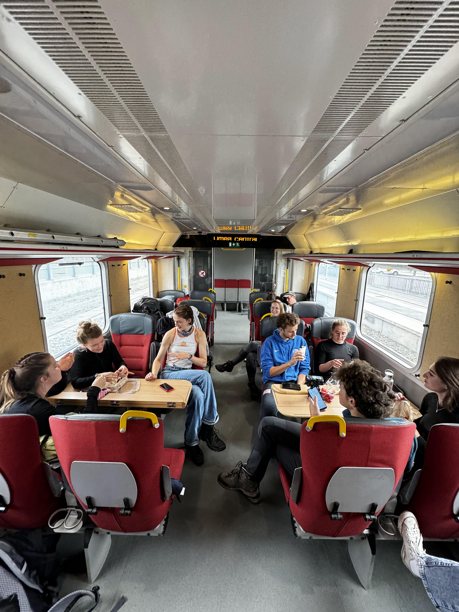
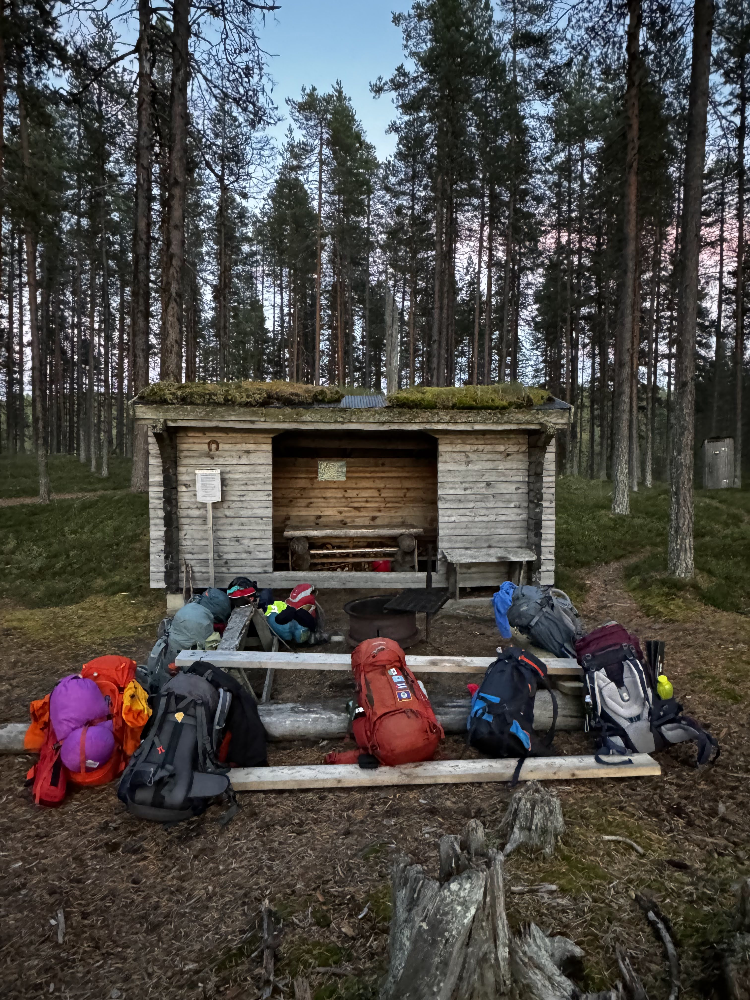
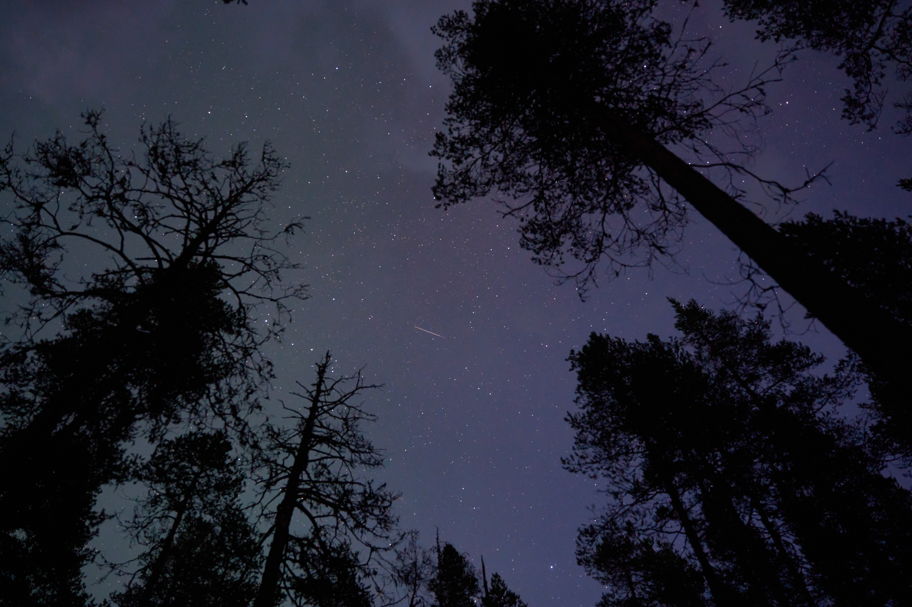
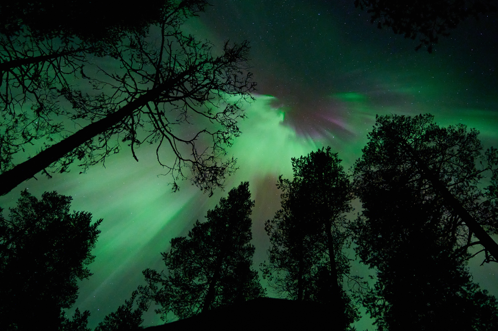
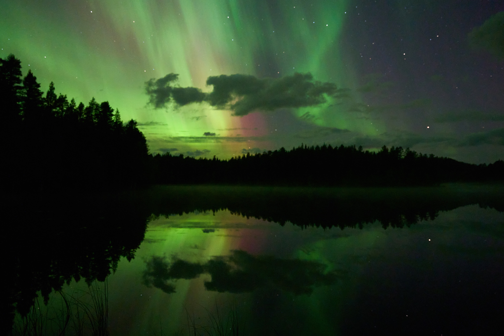
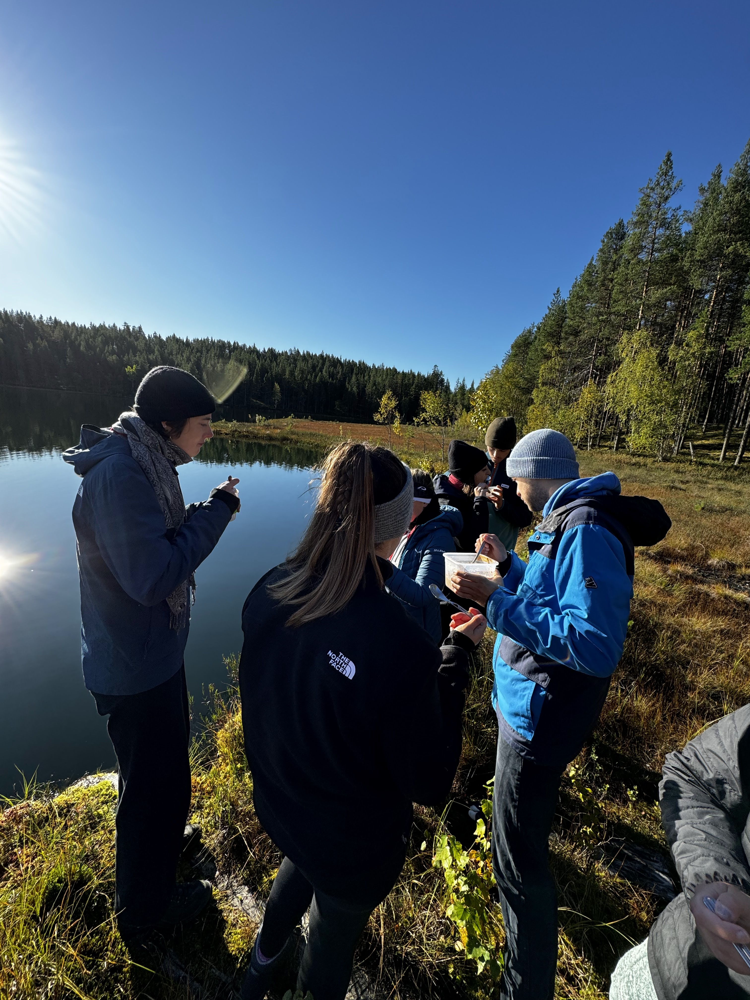
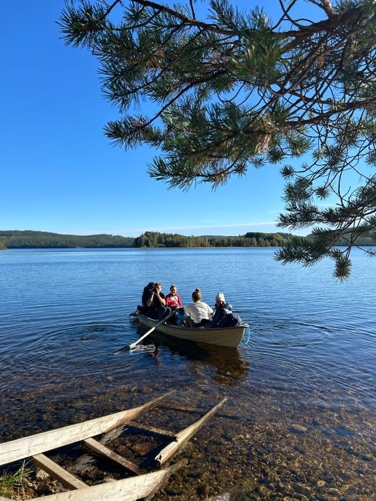
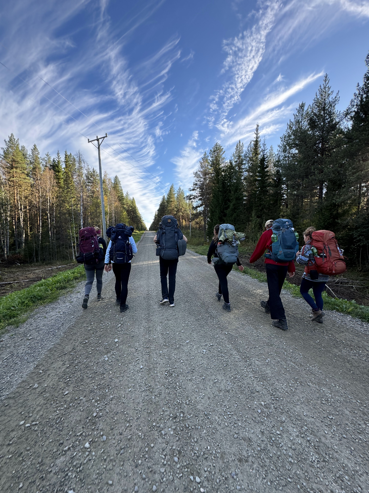
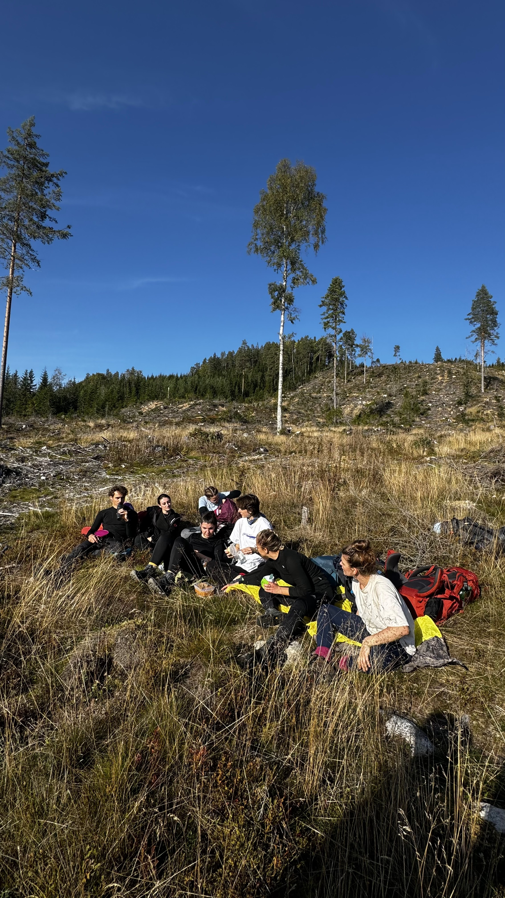

*Hier taucht irgendwann ein Film auf*

Dieses Wochenende sind wir den Isälvsleden gewandert. Das ist ein 60km Wanderweg von Åmsele nach Vindeln (oder andersrum).
Am Freitag sind wir in Umeå gestartet und erstmal zum Bahnhof geradelt.

Da angekommen haben (fast) alle den Zug direkt gefunden und dann ging es auch schon los nach Nordwesten.

In Vindeln sind wir dann umgestiegen in einen Bus der uns bis nach Åmsele gebracht hat, also die ganze Strecke die wir wieder zurück wandern sollte. Das war sehr interessant zu sehen, weil die Person die den Bus gefahren hat kannte alle Schulkinder die mitgefahren sind und hat die direkt vor der Haustür rausgelassen und hat sogar gefragt warum das eine Kind nicht da ist.

Wir sind dann losgewandert aber weil der Bus erst um halb 5 ankam und da praktischerweise ein Klo war sind wir erst so gegen 5 losgekommen. Mit Sonnenuntergang um 7 hatten wir also gar nicht so viel Zeit für die erste Etappe.

Wir kamen dann pünktlich zum Sonnenuntergang einen Berg runter wo uns die Sonne zum Abschied ins Gesicht geküsst hat und konnten dabei dann noch eine Premiumaussicht genießen.

Es wurde dann doch sehr schnell dunkel, sodass wir die Bootsfahrt auf morgen verschieben mussten und stattdessen bei einem anderen Unterschlupf unser Nachtlager aufgeschlagen haben. Es haben nicht alle 11 in den Windschutz gepasst, deswegen haben wir uns auf Zelte und Hängematten verteilt und dann eine sehr große Menge Reissalat gegessen (Bester Trick für den Geschmack: Viel Majo natürlich).

Es wurde dann auch kalt, aber wir wurden abgelenkt vom Feuermachen weil am Himmel dann doch noch einiges los war. Es waren fast keine Wolken am Himmel und das nächste Haus war mindestens 10km entfernt, deswegen hatte man einen wunderschönen Blick auf die Sterne.

Das war aber natürlich nicht das Hauptspektakel, denn nach ein paar Minuten sah es schon so aus:

Und das war noch nicht alles, die Polarlichter haben sich sehr schnell verändert, und nach wenigen Minuten sah es dann so aus:

---

Besser als Fernsehen, und wir hatten echt Glück, weil nur 5km weiter in Richtung Meer war alles wolkenbedeckt. Die sahen auch in echt sehr krass aus, aber die Farben sind nicht ganz so stark wie auf den Fotos.
Irgendwann wurde es aber kalt und alle waren müde, und wir sind dann alle ins Bett/Zelt/Hängematte.

Am Morgen wurden wir dann von ein bisschen Nebel sowohl von oben als auch unten wachgekitzelt (Scherz, es war Lotta).

Pünktlich zum Frühstück kam dann aber die Sonne raus (das war auch dringend notwendig) und wir haben mit Seeblick ein entspanntes Müsli reingefahren.

Danach ging es dann weiter auf die längste Etappe der Tour. Wir hatten uns eine Übernachtung gebucht und mussten deswegen 30km schaffen.
Zuerst mussten wir aber erstmal einen See überqueren, zum Glück gab es aber Boote weil das Wasser war dann doch etwas zu kühl zum schwimmen.

Es war nicht genug Platz in dem Boot für uns alle, deswegen mussten wir ein paar mal Rudern. Es gab auch noch ein zweites Boot was wir dann auf der anderen Seite gelassen haben damit auch die Leute nach uns noch rüberkommen.
Als es alle über den See geschafft hatten ging es dann weiter. Es ging Berg hoch

und Berg runter,

durch dichten Wald

und durch lichten Wald,

über kiesige Straßen

und riesige Straßen.

Eigentlich wollten wir noch die Schlammvulkane von Lerfallet sehen und haben die sehr lange gesucht, aber außer einer grünen Wiese und ein bisschen feuchtem Boden haben wir von der einzigen vulkanischen Aktivität Västerbottens nichts gesehen und waren alle schwer enttäuscht.

Irgendwann hatten wir es alle mit mehr oder weniger großen Blasen (oder keinen für die die sich entschieden haben nicht ihre Schuhe mit einer Dreitageswanderung einzulaufen) geschafft und wir haben in zwei sehr süßen kleinen Hütten übernachtet.

Nach einer erholsamen Nacht haben wir unsere Zelte abgebrochen (OK, die waren schon eingepackt und wir mussten nur die Hütte verlassen) und sind dann weiter für die Schlussetappe.
Zuerst wurden wir aber noch ein bisschen abgelenkt weil wir erst einen verlassenen Schrottplatz auf dem Gelände eines alten Lungensanatoriums gefunden haben, der musste natürlich erforscht werden. Ausßerdem gab es da noch einen alten Wasserturm mit einem 5 Meter durchmessenden Wasserbehälter von dem man einen mega Ausblick über den Wald hatte.

Mittagspause gab es heute da wo wir standen als wir uns gefragt haben ob wir nichtmal eine Pause machen sollten, mitten auf dem Weg. Das war aber nicht so das Problem, wir waren anscheinend die einzigen die den Weg gewandert sind an diesem Wochenende. Die Aussicht war aber super.

Wir haben es dann irgendwann bis nach Vindeln geschafft und nach einem Eisstop bei ICA (50% Rabatt auf Stieleis) und einem Schlussprint zum Bahnhof hatten wir es geschafft und sind wieder mit dem Zug zurück.

