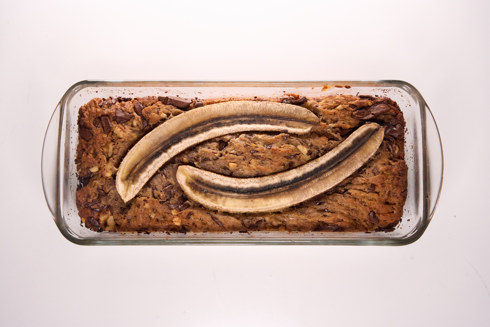
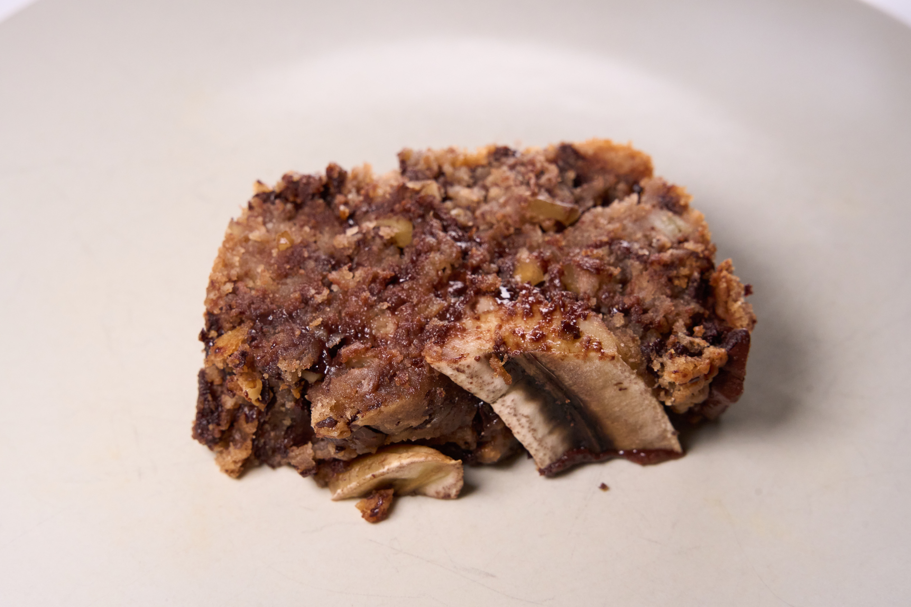

Ein leckeres Bananenbrot, wahlweise mit Schoko und/oder Nuss, kann sowohl als Kuchen oder Brot zubereitet werden

## Zutaten

* 3 sehr reife Bananen (+1 für Deko, optional)
* 160g Weizenmehl (je dunkler desto besser)
* 50g Buchweizenmehl
* 20g Zucker (optional)
* 150 ml Rapsöl oder Margarine
* 3 EL Erdnussbutter
* 1TL Vanilleextrakt
* 3TL Backpulver
* 2TL Zimt
* 1 Prise Salz

### optional

* 200g Zartbitterkuvertüre
* 250g Walnüsse (oder andere Nüsse, zum Beispiel Pekan oder geröstete Haselnüsse)

## Kurzform
Banane zermatschen, danach alle Zutaten zu einem Teig verrühren und in eine gefettete Form füllen. Bei 170°C O/U-Hitze 40-50 Minuten backen.

## Anleitung

1. Die drei Bananen zermatschen.
2. optional: Kuvertüre und/oder Nüsse kleinhacken.
3. Alle anderen Zutaten hinzugeben und zu einem Teig verrühren.
4. Eine Kastenform fetten und den Teig einfüllen.
5. optional: eine Banane der Länge nach aufschneiden und oben in den Teig drücken
6. Das Bananenbrot bei 170°C Ober-/Unterhitze für 40-50 Minuten backen. Das Brot ist fertig wenn ein Stab den man reinsteckt nicht mehr matschigen Teig dran kleben hat
7. Vor dem schneiden und/oder stürzen abkühlen lassen (schmeckt am besten wenn es noch Lauwarm ist)

