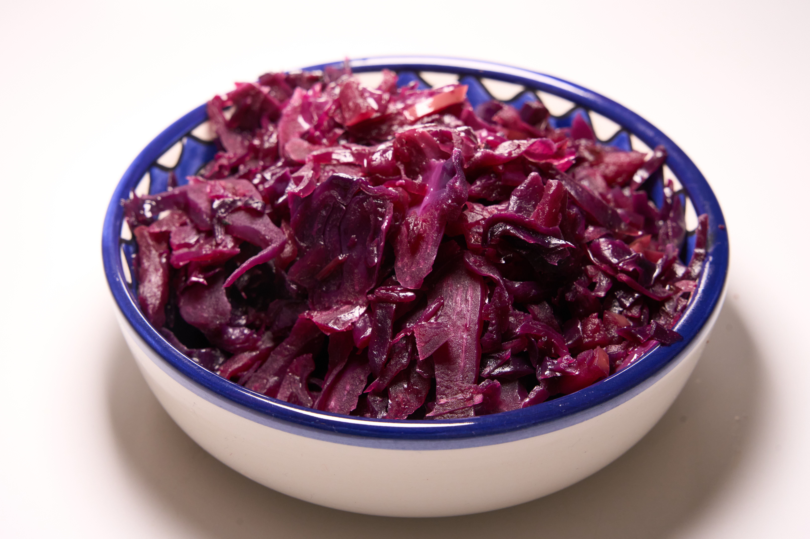

Schmeckt besser als der Rotkohl aus dem Glas, was kann man mehr wollen.

## Zutaten

* 600g Rotkohl
* 2 Zwiebeln
* 2 Äpfel
* 2 Nelken
* 1 Lorbeerblatt
* 4EL Weißweinessig
* Salz
* Pfeffer

## Kurzform
Geschnittene Zwiebeln anbraten, geschnittenen Kohl dazu geben, danach Äpfel und Gewürze dazu und 30-60 Minuten köcheln lassen

## Anleitung

1. Die Zwiebeln in feine würfeln schneiden und in einem Topf anbraten.
2. Den Rotkohl in feine Streifen schneiden (je feiner desto schneller geht es am Ende) und wenn die Zwiebeln glasig sind 5 Minuten anbraten.
3. Die Äpfel kleinschneiden und dann zusammen mit dem Rest der Gewürze dazu geben.
4. 30-60 Minuten köcheln lassen bis der Kohl weich ist. Dabei regelmäßig rühren.
5. Rotkohl genießen.

