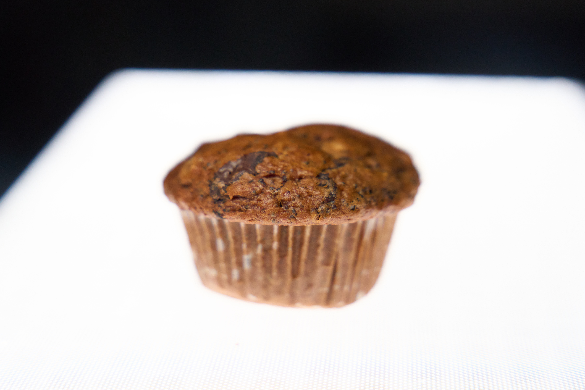
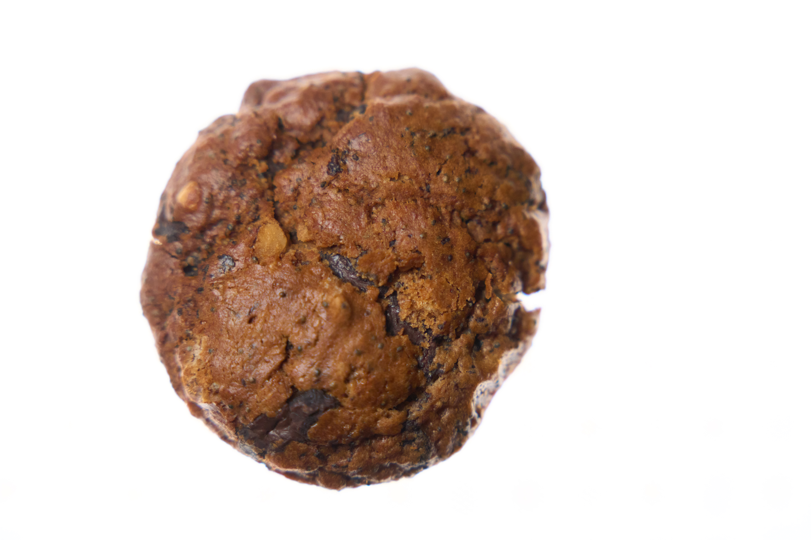
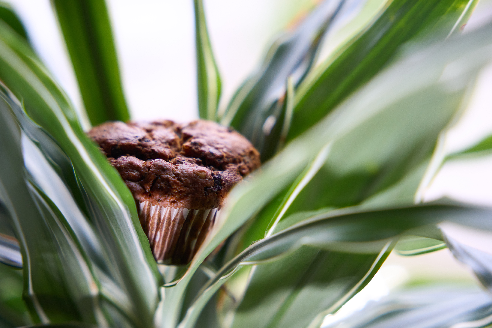

Leckere Muffins mit Schokolade und Nüssen. Reicht je nach Hunger beim Backen für 18-20 Muffins.

## Zutaten

* 300g Weizenmehl (je dunkler desto besser)
* 60g Buchweizenmehl
* 100g brauner Zucker (oder irgendein Zucker)
* 5g Backpulver
* 2g Bikarbonat (oder ein bisschen mehr Backpulver)
* eine gute Prise Salz
* 300ml Hafermilch
* 100ml neutrales Öl (margarine geht auch, die sollte man aber vorher schmelzen)
* 70g Apfelmuss (oder mehr Milch, ca gleiche Menge)
* 200g Zartbitterschokolade (am besten Kuvertüre)
* 300g Walnüsse
* 100g Mohn
* 250g Blaubären (wenn man will)

## Kurzform
Nüsse und Schoko hacken, alles vermischen, in die Form packen, in dem auf 175° O/U vorgeheizten Ofen 40-45 Minuten backen

## Anleitung

1. Ofen auf 175° Ober-/Unterhitze vorgeheizten
2. Die Nüsse und die Schokolade kleinhacken
3. Alle Zutaten vermischen bis ein mehr oder weniger glatter Teig entsteht
4. Den Teig in die Muffinformen füllen (je nach dem wie viel man rein tut hängt der am Ende mehr oder weniger über den Rand)
5. Die Muffins 40-45 Minuten backen

