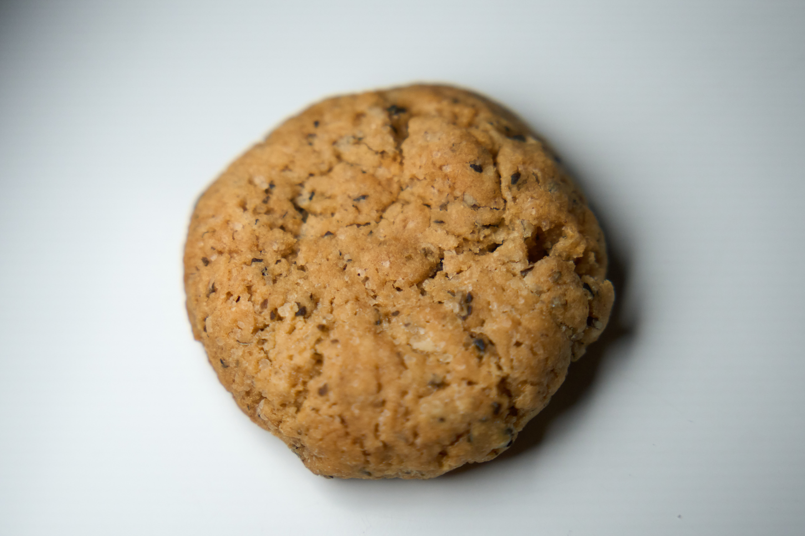
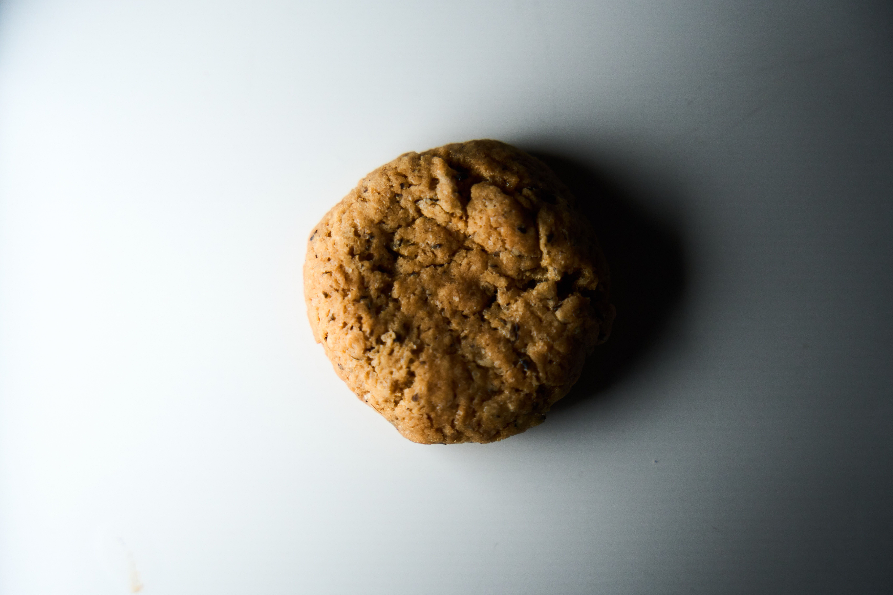
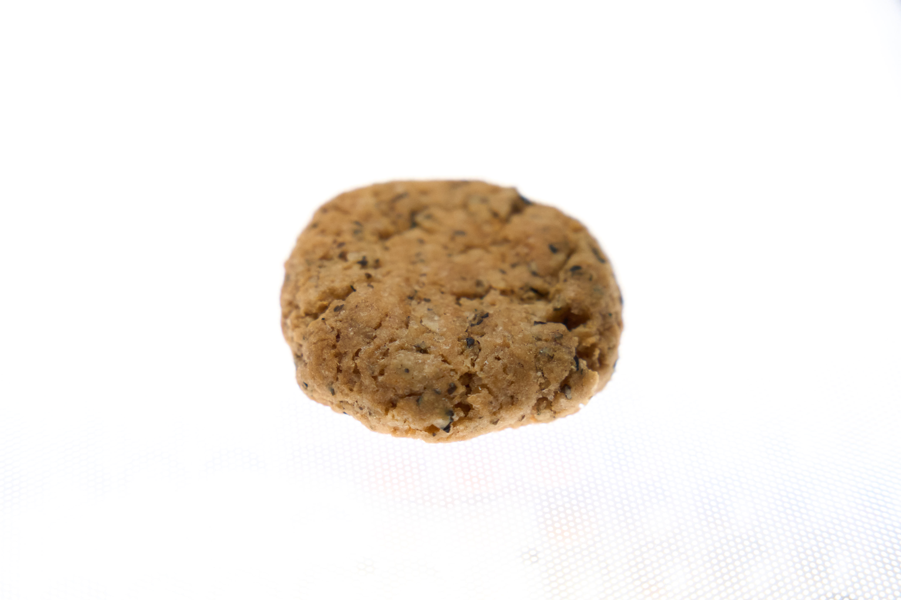

Kekse mit Basilikum

## Zutaten

* 80g Margarine
* 45g Olivenöl
* 2-3 gehäufte Esslöffel getrocknetes Basilikum
* 40g dunkles Tahin (helles geht aber auch)
* 70g Milch (am besten ungesüßt, Sorte relativ egal)
* 300g Weizenmehl (550er oder dunkler)
* 170g brauner Zucker
* 1 Schuss Vanilleextrakt (oder Pulver)
* 1 Teelöffel Backpulver
* 1 Teelöffel Salz

## Kurzform
Basilikum in Butter und Öl anwärmen, dann alles vermengen und in Bällen in dem 180° warmen Ofen 18 Minuten backen, dann mit einer Gabel flachdrücken.

## Anleitung

1. Basilikum, Butter und Öl in einer Pfanne erwärmen, dann 10 Minuten abkühlen lassen. Ofen auf 180° Ober-Unterhitze vorheizen.
2. Währenddessen alle trockenen Zutaten verrühren und dann mit dem Rest verkneten.
3. 3cm Durchmesser Bälle formen und auf einem Backblech verteilen, sodass ein bisschen Platz um die Bälle ist.
4. Für 18 Minuten in dem vorgeheizten Ofen backen.
5. Die Bälle mit einer Gabel flachdrücken und mit Meersalzflocken toppen.

