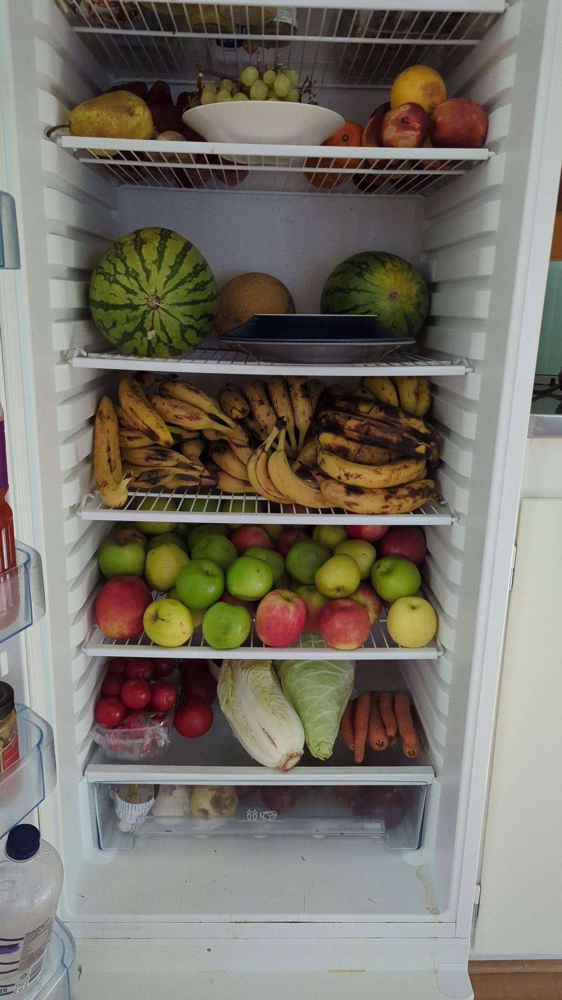

Es ergab sich aber zu der Zeit dass ich mal wieder containern war und damit ich das alles loswerden konnte schon alle Leute mit Bananen in gottloser Menge beschenkt hatte und deswegen jedes Gericht mit Banane sein musste quasi. So oder so ähnlich war es gewesen und steht deswegen hier so geschrieben.

## Zutaten (ergeben hier so ca 4 Portionen (für mich))

* 8-12 Bananen (je nach Größe)
* 200g Linsen
* 800g Kokosmilch (2 Dosen)
* 1 Zwiebel
* Gemüse nach Wahl (ich habe 5 Spitzpaprika, 1 Chinakohl, 5 Möhren verwendet)
* 2 Blöcke Räuchertofu
* Kichererbsen wenn man will
* Knoblauch (so 2-5 Zehen)
* Ingwer, ca Daumengroß (wer kleine Daumen hat nimmt lieber die doppelte Menge)
* Rotes Thai Curry (oder ein anderes wenn man will)
* Kurkuma
* Kreuzkümmel
* Grünzeugbrühe
* Salz
* Zitronensaft
* Stärkebeilage nach Wahl (bei mir waren es Backofenkartoffeln, kann ich mir aber quasi alles zu vorstellen), eigenständig zubereiten sodass das am Ende auch fertig ist

## Kurzform
Alles Gemüse außer den Bananen anbraten (Tofu ist auch Gemüse!), mit Kokosmilch ablöschen, Linsen dazu, kochen bis es weich genug ist. Alles so würzen dass es ein bisschen zu sauer ist. Bananen anbraten und am Ende reinwerfen. Mit Stärkeprodukt der Wahl servieren.

## Anleitung

1. Die Zwiebeln klein und den Tofu in Würfel schneiden und zusammen anbraten. Währenddessen alle anderen Gemüsen schneiden und dann erstmal den Knoblauch und den Ingwer in die Pfanne pressen. Danach die Gemüse in einer mehr oder weniger sinnvollen Reihenfolge dazu geben.
2. Bevor das alles ganz durch ist die Linsen und das Curry und andere Gewürz dazu geben und dann mit Kokosmilch und 2 halben Dosen Wasser ablöschen. Man könnte sicher auch die Brühe schon ins Wasser rühren aber wer macht das schon. Und außerdem bleibt das dann in den Dosen hängen, das will man ja auch nicht.
3. Während das jetzt so vor sich hinköchelt die Bananen schälen (wichtig) und dann in so schiefe Stücke schneiden (oder grade, ihr macht doch eh was ihr wollt), länger als breit auf jeden Fall, und dann anbraten (mit Öl Larissa!(und auch alle anderen, die leckere karamelisierte Kruste bleibt sonst nämlich in der Pfanne)).
4. Das ganze mit Salz und Zitronensaft so abschmecken dass es ein bisschen zu sauer ist, und dann die Bananen einrühren, die machen dass dann wieder süßer.
5. Mit Stärkebilage der Wahl (sollte jetzt auch fertig sein) servieren

